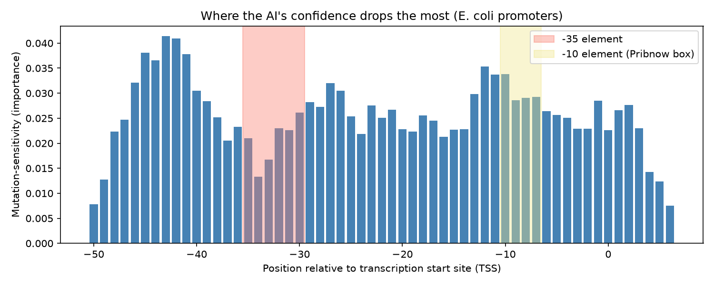
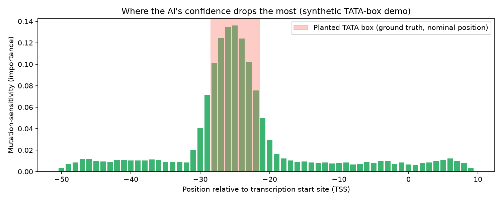

<h1 align="center">DNA Promoter Scanner</h1>

<p align="center">
  <strong>Teaching a machine to find the "on switches" in DNA — and then
  asking it to show its work.</strong>
</p>

<p align="center">
  An interpretable machine learning tool that locates promoter regions in a
  DNA sequence, identifies the exact bases its prediction depends on, and
  explains them in plain language. Free, browser-based, no installation.
</p>

<p align="center">
  <a href="https://YOUR-APP-NAME.streamlit.app"><strong>▶ Try the live tool</strong></a>
  ·
  <a href="#what-it-actually-does">How it works</a>
  ·
  <a href="#results">Results</a>
  ·
  <a href="#what-this-project-does-not-claim">Limitations</a>
</p>

<p align="center">
  
  
  
  
</p>

---

## The problem

Every gene has a **promoter** — a short stretch of DNA just upstream of it
that acts as an on switch. It is where the cell's transcription machinery
docks before it can read the gene at all. Find the promoter and you have
found the control point; miss it and a gene stays silent.

Biologists have excellent software for locating promoters. That software is
also, almost without exception, built for biologists: command-line tools,
FASTA files, installation guides, parameter sets. A high school student who
just learned what a promoter is, a teacher building a lesson, or a
community-lab iGEM team designing a construct has no realistic on-ramp to
any of it.

There is a second, subtler problem. Most modern sequence models answer
*"is this a promoter?"* with a number, and stop. They rarely answer the
question a learner actually asks next: **"which letters made you say
that?"**

This project is an attempt at both — a tool that is genuinely usable by a
non-specialist, and that is transparent about its own reasoning.

## What it actually does

Paste in a DNA sequence. The tool returns the region most likely to be a
promoter, with every base colour-coded by how much the model's confidence
depends on it, plus a plain-language label if that region matches a
textbook regulatory motif.

Under the hood there are four steps, and the third is the interesting one.

**1 · Represent the sequence numerically.** DNA is a string over
`{A, C, G, T}`. Each sequence is broken into overlapping *k*-mers — every
substring of length *k* — and converted to a frequency vector.
Deliberately, **no positional information is encoded**. The model is never
told where in the sequence to look.

**2 · Train a classifier.** Logistic regression, chosen over a neural
network on purpose: it trains in under a second, it does not overfit 106
examples into meaninglessness, and it is simple enough that its behaviour
can be interrogated honestly rather than hand-waved at.

**3 · Interrogate the model with in-silico saturation mutagenesis.** This
is the core technique, borrowed from how wet-lab geneticists probe function
with real mutations — but run entirely in software, on every position at
once. For each position in the sequence, substitute each of the three
alternative bases, re-score the mutated sequence, and record how far the
model's confidence falls. A position whose mutation barely moves the score
is one the model ignores. A position whose mutation collapses the score is
load-bearing. Sweeping all positions yields an **importance profile**: a
per-base map of what the model is actually keying on.

**4 · Validate against known biology.** The importance profile is a
prediction that can be checked. Bacterial promoters are known to contain a
**-10 element (Pribnow box)** and a **-35 element**. If the model — which
was given no positional hints whatsoever — concentrates its importance at
those coordinates, the technique demonstrably recovers real regulatory
structure rather than dataset artefacts.

```
  sequence ──▶ k-mer features ──▶ classifier ──▶ mutate every base,
                                                  re-score, measure the drop
                                                          │
                                                          ▼
                            per-base importance profile ──▶ compare against
                                                            known -10 / -35
                                                            motif positions
```

## Results

Two independent tracks were run, and they are reported separately because
they support conclusions of very different strength.

| | Bacterial track (real data) | TATA-box track (synthetic) |
|---|---|---|
| **Data** | 106 real *E. coli* sequences, UCI Molecular Biology dataset | Generated locally, with a TATA motif planted at a known position |
| **Classifier** | test accuracy 1.00, ROC-AUC 1.00 *(on a small held-out split)* | test accuracy ≈0.93, ROC-AUC ≈0.97 |
| **Importance at the target motif** | -10 element: **1.18×** background · -35 element: 0.80× | **4.66×** background enrichment in the planted region |
| **Top positions inside the motif** | — | **7 of 7** |
| **Single-base effect** | 87.6% → ~79% confidence | 84.5% → ~65% confidence |
| **What it supports** | Modest positive evidence for the -10 box; no clear support for the -35 box | Clean confirmation that the method recovers a motif it was never shown |

The synthetic track exists precisely because the real track cannot prove
the method works. With real data, the "right answer" is itself a literature
claim; with planted data, ground truth is known exactly, so the method can
be audited against it. It recovers the planted motif cleanly — **a 20-point
confidence swing from changing a single letter**, at a position the model
was never told about.

The real-data track is then the honest test, and it returns an honest
result: partial support for one known element, none for the other, at this
dataset size.

<table>
<tr>
<td width="50%"></td>
<td width="50%"></td>
</tr>
<tr>
<td align="center"><em>Bacterial track: importance per position, with the literature -35 and -10 windows shaded.</em></td>
<td align="center"><em>TATA track: importance concentrates sharply inside the planted motif.</em></td>
</tr>
</table>

## What this project does not claim

Stating this clearly is part of the work, not a disclaimer bolted onto it.

- **It does not discover new biology.** The -10 and -35 elements have been
  textbook material for decades. The contribution is methodological and
  educational: an interpretability technique demonstrated end-to-end and
  packaged for people who could not otherwise run it.
- **The bacterial validation is real but modest.** 1.18× enrichment at the
  -10 element, and 0.80× at the -35 element — that is, the -35 element is
  *not* enriched above background by this method at this dataset size.
- **Only ~21% of sequences give a clean hit.** Of the 53 real promoters, 11
  produce an importance profile that aligns cleanly with a known motif. The
  app's default example was chosen from that 21% so a first-time visitor
  sees a clear result; most pasted sequences will honestly report *no
  match*, which is the tool working correctly rather than failing.
- **The TATA track is synthetic.** It validates the *method* against an
  answer this project planted itself. It is a teaching demo and is labelled
  as one in the interface.
- **Bacterial mode does not transfer to human DNA.** Bacterial and
  eukaryotic gene regulation differ fundamentally.
- **This is an educational tool**, not a clinical, diagnostic, or
  production instrument.

## Design decisions worth defending

**Two tracks, never mixed.** A genuine result on real data and a clean
demonstration on synthetic data answer different questions. Merging them
would let the strong synthetic number quietly borrow credibility for the
weak real one. They are separated in the code, in the interface, and in the
table above.

**Position-agnostic features.** The model could trivially have been given
positional encodings, which would have improved accuracy and destroyed the
experiment — a model told where to look proves nothing by looking there.
Withholding that information is what makes the importance profile evidence.

**A small interpretable model over a large one.** With 106 training
examples, a deep network would fit the data and explain nothing. Logistic
regression makes the interpretability claim checkable.

**No live AI or API calls in the running app.** Every prediction comes from
a classifier trained once, offline, and shipped as a 9 KB file. The
consequence is that hosting costs $0 at any traffic level, which is what
makes a *permanently free public tool* possible rather than a demo that
dies when a credit balance runs out. A generative model was used only
offline, with human fact-checking, to help draft explanatory prose — never
in the analysis path.

**A benchmark against general-purpose chatbots.** `comparison/` contains a
prepared blind evaluation: 16 held-out sequences (8 promoters, 8
non-promoters), stripped of labels, with the trained classifier's
predictions pre-recorded and a scoring script ready to run. It asks whether
a general-purpose LLM shown raw DNA can match a small purpose-built model.
*(Harness complete; the chatbot responses are not yet filled in, so no
result is claimed here.)*

## Try it

**Online — nothing to install:** open
**[the live app](https://YOUR-APP-NAME.streamlit.app)**, pick a mode, paste
a sequence or use the pre-filled example, and click *Scan sequence*. Works
on a phone.

**Locally:**

```bash
# macOS / Linux
python3 -m venv .venv
.venv/bin/pip install -r requirements.txt
.venv/bin/python -m streamlit run app/app.py
```

```bat
REM Windows — or just double-click setup.bat once, then run_app.bat
py -3 -m venv .venv
.venv\Scripts\python -m pip install -r requirements.txt
.venv\Scripts\python -m streamlit run app\app.py
```

Opens at `http://localhost:8501`. The trained models are committed, so no
training step is required to run the app.

**Reproduce the results:**

```bash
python src/train_model.py           # bacterial classifier      -> data/model.pkl
python src/train_tata_model.py      # TATA-demo classifier      -> data/tata_model.pkl
python src/mutate_scan.py           # saturation mutagenesis    -> importance profile
python src/compare_to_known_motifs.py   # validate vs -10 / -35 elements
python src/tata_validate.py             # validate vs the planted TATA motif
python src/visualize_profile.py         # regenerate the charts above
python src/visualize_tata_profile.py
python src/demo_single_mutation.py --mode tata   # the single-base swing, live
```

## Repository layout

```
app/app.py                          the public web interface (Streamlit)

src/  data_utils.py                 dataset parsing, train/test split
      featurize.py                  DNA sequence -> k-mer frequency vector
      train_model.py                train + evaluate the bacterial classifier
      mutate_scan.py                in-silico saturation mutagenesis engine
      compare_to_known_motifs.py    validate results against the -10/-35 literature
      scan_arbitrary_sequence.py    slide the model across any user-pasted sequence
      motif_match.py                rule-based motif labelling (no AI, no cost)

      synthetic_tata_data.py        generate the planted-motif dataset
      train_tata_model.py           train the TATA-demo classifier
      tata_validate.py              validate against the known planted position
      tata_scan_arbitrary_sequence.py   scanner, TATA-demo mode

      demo_single_mutation.py       live demo: one base, measured confidence drop
      visualize_profile.py          poster chart, bacterial track
      visualize_tata_profile.py     poster chart, TATA track
      llm_comparison_prepare.py     build the blind classifier-vs-chatbot benchmark
      llm_comparison_score.py       score it once responses are filled in
      generate_ai_explanations.py   offline writing aid (not in the analysis path)

data/ promoters.data                UCI dataset, 106 labelled E. coli sequences
      model.pkl, tata_model.pkl     trained classifiers (committed, so the app runs)
      *.npy, *.png                  importance profiles and charts

comparison/                         the blind LLM benchmark: prompts + score sheet
PROJECT_GUIDE.md                    full technical write-up: architecture,
                                    verified outputs, limitations
```

## Stack

Python 3.13 · scikit-learn · NumPy · Matplotlib · Streamlit. Four
dependencies, pinned to the exact versions the committed models were
trained with, so the deployed environment reproduces the tested one
exactly.

## Data

[UCI Machine Learning Repository — Molecular Biology (Promoter Gene
Sequences)](https://archive.ics.uci.edu/dataset/67/molecular+biology+promoter+gene+sequences):
106 labelled 57-bp *E. coli* windows (53 promoters, 53 non-promoters)
spanning positions -50 to +7 relative to the transcription start site.
Public and freely redistributable; included in `data/`. The TATA-box track
uses no external data — it is generated locally by
`src/synthetic_tata_data.py`.

---

<p align="center">
  <sub>Built as an independent project. Full technical detail, verified
  outputs, and the complete limitations discussion are in
  <a href="PROJECT_GUIDE.md">PROJECT_GUIDE.md</a>.</sub>
</p>
